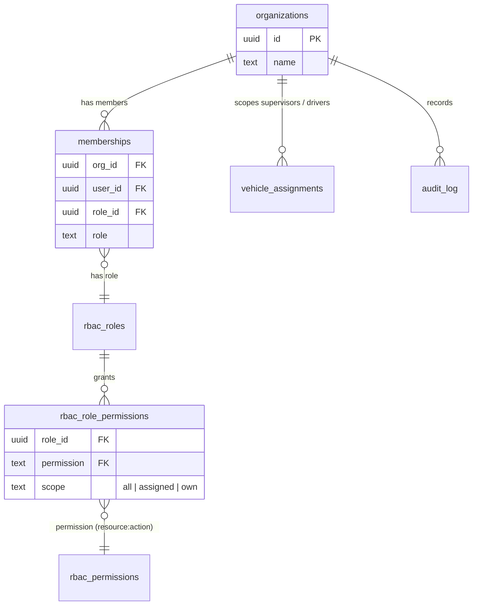
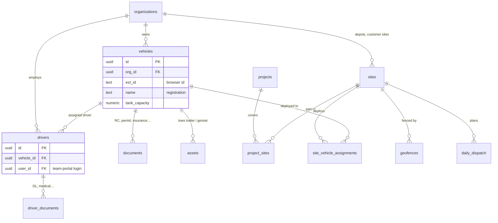
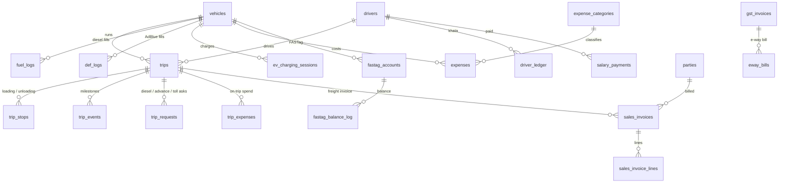
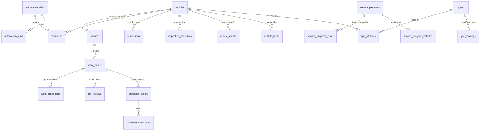
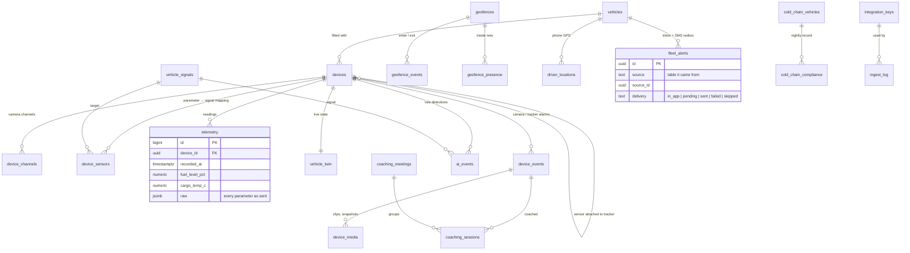
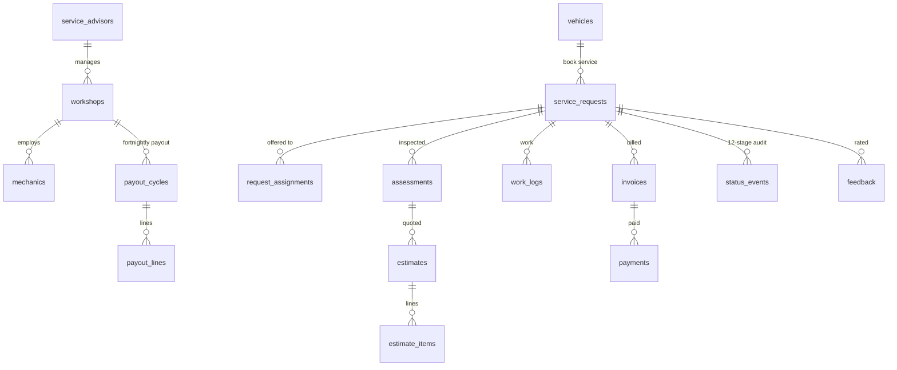

# FleetWorks data model

Generated from the live database (Supabase project `crdblxeufbhysglbbtxi`) on
2026-09-29: **131 tables, 16 views, 222 foreign keys**, every table under row-level
security. Every tenant table carries `org_id → organizations`; access is generated
per table from `rbac_table_registry` (see `supabase/migrations/20260922110000_rbac_enforce.sql`).

The diagrams show the main tables of each domain and how they join. Columns are
limited to keys and the fields that define the relationship; the migrations are the
full reference.

## 1. Tenancy and access

## 2. Fleet core: vehicles, people, places

## 3. Trips, fuel and money

## 4. Maintenance

## 5. FleetSafe: devices, telemetry, incidents

`incident_analyses` points at either `ai_events` or `device_events` by
(`source`, `event_id`): a polymorphic reference, so it has no foreign key.

## 6. Workshop marketplace and service workflow

Also: `insurance_policies → insurance_claims`, `whatsapp_contacts → whatsapp_messages`,
`vendor_leads / scraper_runs` (partner sourcing), `leads`, `vendor_applications`.

## 7. Which page uses which tables

| Page | Tables (read / write) |
|---|---|
| Home, FleetOps Dashboard | vehicles, drivers, issues, work_orders, reminders, documents, inspections, expenses, fuel_logs |
| Add Vehicle, Vehicle List & RTO | vehicles, documents |
| Trips & Loads | trips, trip_stops, trip_events, trip_requests, trip_expenses |
| Drivers & Contacts, Assignments | drivers, vehicle_assignments |
| Work Orders, Service History, Service Tasks | work_orders, work_order_lines, bill_reviews, issues |
| **Service Programs** | service_programs, service_program_tasks, service_program_vehicles *(new)* |
| Spares Godown, Purchase Orders | parts, purchase_orders, purchase_order_lines |
| Tyre Readings | tyres, tyre_fitments, tyre_readings (v_tyre_manager) |
| Inspections, Forms | inspections |
| **Inspection Schedules** | inspection_schedules *(new)* |
| Issues | issues |
| **Faults** | vehicle_faults *(new)* |
| **Recalls** | vehicle_recalls *(new)* |
| Reminders, Renewals, Compliance Radar | reminders, documents, driver_documents, vehicles |
| Fuel Dashboard, Diesel & Mileage | fuel_logs |
| **DEF / AdBlue** | def_logs *(new)* |
| **EV Charging** | ev_charging_sessions *(new)* |
| **Places** | sites, geofences *(no new table)* |
| FleetFin: Expenses, Bills, Accounts, Reports | expenses, expense_categories, expense_change_requests, gst_invoices |
| Driver Khata, Payroll | driver_ledger, salary_payments, payment_requests, driver_payout_details |
| Toll & FASTag | fastag_accounts, fastag_balance_log |
| Invoices, Purchase Invoices | sales_invoices, sales_invoice_lines, parties, items |
| WhatsApp | whatsapp_contacts, whatsapp_messages, whatsapp_templates |
| Command Centre, Safety & Coaching | v_safety_events, v_driver_safety_score, coaching_sessions, ai_events, devices |
| Incident Triage | ai_events, device_events, incident_analyses, device_media |
| AI Vision | devices, device_events |
| Fleet View, Operation Centre | vehicles, driver_locations, vehicle_twin, geofences, assets, ai_events |
| Geofences, Assets & Trailers | geofences, geofence_events, assets |
| Device Hub | devices, device_channels, device_sensors, integration_keys, ingest_log, fleet_alerts, fleetsafe_settings |
| Fuel Sensor & Theft | telemetry, ai_events, devices |
| Insurance | insurance_policies, insurance_claims (v_insurance_radar) |
| Book Service, Find a Garage | service_requests and the workflow tables, v_workshop_directory |
| Team & Access | memberships, rbac_roles, vehicle_assignments |
| Sites & Projects, Daily Dispatch | sites, projects, project_sites, site_vehicle_assignments, daily_dispatch |

The six pages marked *new* have their tables from migration
`20260929110000_placeholder_pages_tables.sql`; their screens are still "Coming soon".

## 8. Known model debt

* **Two tyre models.** `tyres / tyre_fitments / tyre_readings` (used by the app) and
  `tire_registry / tire_pressure_readings / tire_*` (unused). Pick one and drop the other.
* **Two telemetry models.** `telemetry` (the live pipeline) and `vehicle_telemetry` plus its
  `_hourly / _daily / _latest` views from the abandoned TimescaleDB design. The same for
  `temperature_readings` (superseded by `telemetry.cargo_temp_c`) and
  `fuel_trips / fuel_alerts` (superseded by `ai_events`).
* **Deletes blocked.** 20 foreign keys to `organizations` / `vehicles` have no `on delete`
  rule, so deleting a fleet or a vehicle fails. A fix is queued as a separate task.
* **`fleets`** still holds the per-owner JSON blob; since the DB-direct migration it carries
  settings only.

## 9. Should FleetWorks move to a graph database?

**No, not as the system of record.** A graph model is the right tool when the questions
are deep, variable-length relationship walks ("everyone within 5 hops of X"). FleetWorks'
data is the opposite shape:

* **Tenant-scoped and permissioned row by row.** Security is Postgres row-level
  security generated per table; no graph database offers an equivalent that plugs
  into Supabase auth.
* **Transactions matter.** A reading, the geofence edge it causes and the alert it
  raises commit together; payroll, invoices and GST need strict consistency.
* **Most data is time series and ledgers** (telemetry, fuel, expenses, khata), which
  graph stores handle poorly.
* **The relationships are shallow**: vehicle → driver → trip → site is 1–3 joins, which
  Postgres answers in milliseconds with the foreign keys above.
* **Platform fit.** Supabase does not offer Apache AGE, the extension that gives Postgres a
  Cypher graph layer. A separate graph database (Neo4j and the like) would be a second
  datastore to run and sync, against the no-extra-infrastructure rule.

**What gives the graph view without the cost**, all available on this database:

1. **`pg_graphql`** (available, not enabled): query the existing tables as a graph of
   linked records (`vehicle { drivers { trips { stops } } }`) over the same RLS.
2. **Recursive CTEs** for the few real traversals (who-reports-to-whom, part ←
   supplier ← vendor chains).
3. **`pgRouting`** (available) if route optimisation on a road network is ever needed:
   graph algorithms where they actually help.
4. A **relationship view** (`from_type, from_id, rel, to_type, to_id`) generated from the
   foreign keys, if a graph visualisation of a fleet is wanted in the UI.
